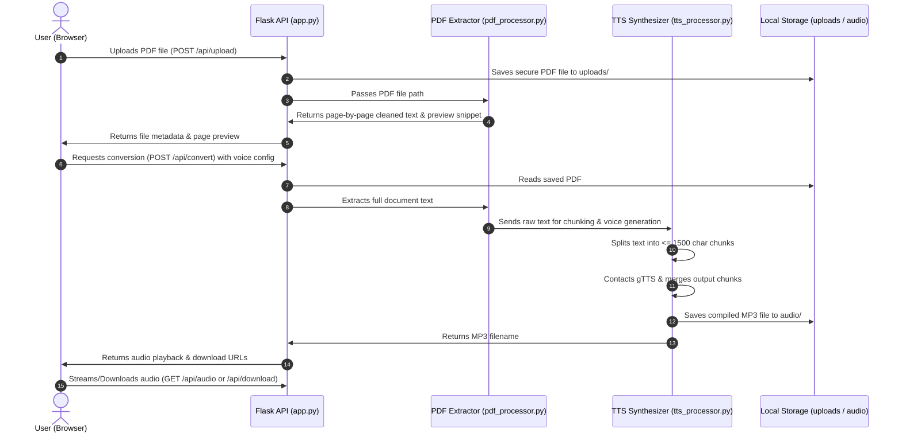

# VoicePDF — Premium PDF to Audio Generator

VoicePDF is a full-stack web application that allows users to upload PDF documents, extract text page-by-page, sanitize/chunk it, and convert it to spoken audio files (MP3) using Text-to-Speech (TTS) technology. The project features a premium glassmorphic dark-theme UI and an elegant custom audio player with timeline controls, speed options, volume controls, and download features.

---

## 🏗️ Project Architecture & Data Flow

Below is the flow diagram representing how data moves through the VoicePDF application:



---

## 📁 Project Folder Structure

```text
PDF2AUDIO/
├── app.py                  # Flask Application Backend Routing
├── create_sample_pdf.py    # Automation script to generate a sample PDF for testing
├── requirements.txt        # Python dependency packages
├── README.md               # Project documentation & API manuals
├── templates/
│   └── index.html          # Frontend SPA (Single Page Application)
├── static/
│   ├── css/
│   │   └── style.css       # Core UI styles (theme variables, glassmorphism, player layout)
│   └── js/
│       └── main.js         # Interactive application logic & audio controls
├── uploads/                # Directory storing temporary uploaded PDFs (auto-cleaned)
├── audio/                  # Directory storing temporary generated MP3s (auto-cleaned)
└── utils/
    ├── __init__.py
    ├── pdf_processor.py    # Text extraction and cleaning module
    └── tts_processor.py    # Voice selection, text chunking, and gTTS processing module
```

---

## 🚀 Setup & Installation Steps

Follow these step-by-step instructions to get the application running locally:

### Prerequisites
- Python 3.8 or higher installed on your computer.
- Pip (Python Package Installer).
- *(Optional)* Tesseract-OCR installed on your system if you want to support OCR for scanned/image PDFs.

### 1. Clone or Open Project Directory
Navigate into the root directory of the project:
```bash
cd PDF2AUDIO
```

### 2. Create and Activate Virtual Environment
Create a Python virtual environment to keep packages isolated:

**On Windows:**
```powershell
python -m venv .venv
.venv\Scripts\activate
```

**On macOS/Linux:**
```bash
python3 -m venv .venv
source .venv/bin/activate
```

### 3. Install Dependencies
Install all required libraries inside the virtual environment:
```bash
pip install -r requirements.txt
```

### 4. Create the Sample PDF for Testing
Run the helper script to automatically compile a test document in the workspace:
```bash
python create_sample_pdf.py
```
This generates a multi-page PDF (`sample_document.pdf`) containing sample sections in English and Spanish to verify multi-page reading and accent capabilities.

### 5. Run the Server
Launch the Flask development server:
```bash
python app.py
```
By default, the server will start on **`http://127.0.0.1:5000`** (or `http://localhost:5000`).

---

## 🧪 REST API Documentation (Postman / cURL Examples)

You can test the application using API clients like Postman, Insomnia, or command-line `cURL`. Below are exact examples for testing the backend endpoints.

### 1. Upload API
Uploads a PDF file to the backend, validates its format, extracts page structures, and returns page and character counts along with a text preview of the first two pages.

* **URL**: `/api/upload`
* **Method**: `POST`
* **Content-Type**: `multipart/form-data`
* **Body Form Parameters**:
  * `file`: `[File Upload (PDF)]`

#### cURL Example:
```bash
curl -X POST -F "file=@sample_document.pdf" http://127.0.0.1:5000/api/upload
```

#### JSON Response (Success):
```json
{
  "success": true,
  "filename": "sample_document_1716480000.pdf",
  "original_filename": "sample_document.pdf",
  "pages_count": 2,
  "characters_count": 2184,
  "preview": "--- Page 1 ---\nVoicePDF - Test Document\nThis is a sample PDF document...\n\n--- Page 2 ---\n3. Multi-Language Synthesis..."
}
```

---

### 2. Convert API
Triggers full text extraction from a previously uploaded PDF filename, chunks the text, invokes the Text-to-Speech synthesizer, compiles the final MP3, and returns the audio play and download endpoints.

* **URL**: `/api/convert`
* **Method**: `POST`
* **Content-Type**: `application/json`
* **JSON Body Parameters**:
  * `filename` (string, required): The unique filename returned by `/api/upload`.
  * `lang` (string, optional, default: `"en"`): The voice language code (e.g. `"en"`, `"es"`, `"fr"`, `"de"`, `"pt"`).
  * `tld` (string, optional, default: `"com"`): The top-level domain mapping for localized accent/accent (e.g., `"com"` for US, `"co.uk"` for UK, `"co.in"` for Indian accent).
  * `slow` (boolean, optional, default: `false`): Enable slower reading pace.

#### cURL Example:
```bash
curl -X POST -H "Content-Type: application/json" \
  -d '{"filename": "sample_document_1716480000.pdf", "lang": "en", "tld": "com", "slow": false}' \
  http://127.0.0.1:5000/api/convert
```

#### JSON Response (Success):
```json
{
  "success": true,
  "filename": "sample_document_1716480000_en_com.mp3",
  "audio_url": "/api/audio/sample_document_1716480000_en_com.mp3",
  "download_url": "/api/download/sample_document_1716480000_en_com.mp3"
}
```

---

### 3. Audio Streaming API
Streams the generated MP3 file to the browser (perfect for embedding directly in `<audio>` source tags).

* **URL**: `/api/audio/<filename>`
* **Method**: `GET`

#### cURL Example:
```bash
curl -I http://127.0.0.1:5000/api/audio/sample_document_1716480000_en_com.mp3
```

---

### 4. Audio Download API
Forces the download of the generated MP3 as an attachment.

* **URL**: `/api/download/<filename>`
* **Method**: `GET`

#### cURL Example:
```bash
curl -O -L http://127.0.0.1:5000/api/download/sample_document_1716480000_en_com.mp3
```

---

## 🔒 Security & Robustness Features

1. **Secure File Uploads**: Uploads are restricted strictly to files with a `.pdf` extension. Size is capped at 15MB to prevent memory exhaustion.
2. **Filename Sanitization**: Utilizes Werkzeug's `secure_filename()` combined with unique epoch timestamps. This prevents directory traversal attacks and avoids file collision problems.
3. **Auto-Cleanup Routine**: Every upload or convert request triggers a sanitation check. Files inside the `uploads/` and `audio/` directories that are older than **1 hour** are automatically removed, keeping disk usage under control in production environments.
4. **Chunked Text Synthesis**: Google TTS (gTTS) fails or times out when handling large chunks of text. VoicePDF splits document text into paragraphs/sentences not exceeding **1,500 characters** before making API requests, ensuring stability for long documents.

---

## ☁️ Deployment Ready configuration

VoicePDF is set up to be immediately deployable on cloud providers:

### Render & Railway Setup
1. Fork or upload this codebase to a GitHub repository.
2. Link the repository to your Render or Railway dashboard.
3. Choose the **Python** web service environment.
4. Set the **Build Command** to:
   ```bash
   pip install -r requirements.txt
   ```
5. Set the **Start Command** to run using Gunicorn:
   ```bash
   gunicorn app:app
   ```
6. Set the environment variable if needed. Flask works out of the box.

### Heroku Setup
A `Procfile` can be added to the project root with the following line:
```text
web: gunicorn app:app
```

---

## 🛠️ Technology Stack

- **Backend**: Python 3, Flask (REST Framework)
- **Frontend**: HTML5, Vanilla CSS3 (Custom Glassmorphism, Theme Variables), Vanilla JavaScript (ES6)
- **PDF Extraction**: `pdfplumber` (layout parsing), `pypdf` (lightweight fallback)
- **Text-To-Speech**: `gTTS` (Google Translate Voice TTS Engine)
- **Production Server**: `gunicorn`
